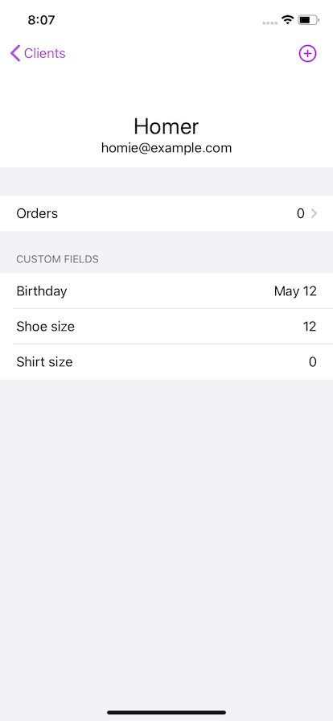

# Shopify mobile app

Clientele is an example iOS app written in SwiftUI that authenticates to Shopify without the need of a server.

Authentication uses OAuth with the help of `ASWebAuthenticationSession` on the client, and the [worker.js](Clientele/Server/worker.js) script which can be hosted as a serverless function, like a [Cloudflare Worker](https://workers.cloudflare.com).

For persistance, the app uses Shopify's API to associate data to resources as [metafields](https://shopify.dev/docs/admin-api/rest/reference/metafield?api[version]=2020-07).

## Environment variables

`apiKey`: The API key from the app's settings in the Partner Dashboard
`loginURL`: The URL to initiate the OAuth login request. See [Server](Server/readme.md)
`defaultDomain`: (optional) hardcoded shopdomain to speed up login flow while in development

Note: Xcode 12 and iOS 14 are required.
